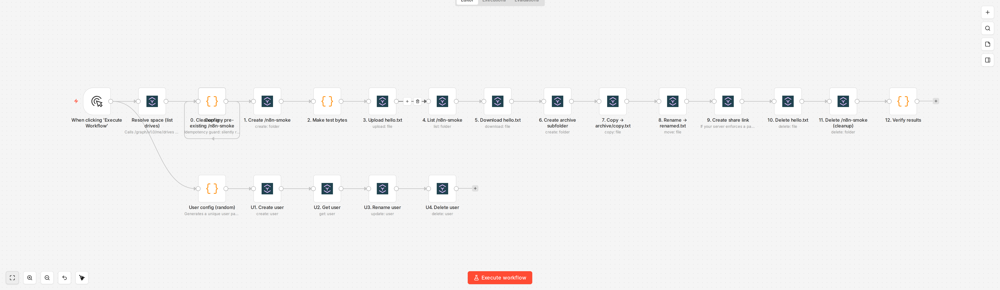

# @opencloud-eu/n8n-nodes-opencloud

> n8n community node for [OpenCloud](https://opencloud.eu/) — files, folders
> and shares against the OpenCloud API.

Built on top of [Libre Graph](https://github.com/opencloud-eu/libre-graph-api)
(metadata, sharing, drive enumeration) and OpenCloud WebDAV (content I/O,
copy, move, delete).



---

## Operations

| Resource | Operations |
| --- | --- |
| **Space** | List |
| **File** | Copy · Delete · Download · Move · Share · Upload |
| **Folder** | Copy · Create · Delete · List · Move · Share |
| **User** | Create · Delete · Get · Get Many · Update *(admin only)* |

## Credentials

| Field | Notes |
| --- | --- |
| **Server URL** | e.g. `https://opencloud.example.com` |
| **User** | username or email |
| **Password** | app token (preferred) or account password — Basic auth |
| **Skip TLS verification** | accept self-signed or otherwise untrusted certs |

Generate an app token from your OpenCloud profile for automation use; account
passwords work for quick tests.

## Install

> **Status:** not yet published to npm. Once published, this will be installable
> from n8n's UI: **Settings → Community Nodes → Install →
> `@opencloud-eu/n8n-nodes-opencloud`**.

For now, install from source:

```bash
git clone https://github.com/opencloud-eu/n8n-nodes-opencloud.git
cd n8n-nodes-opencloud
pnpm install
pnpm build

# Then either:
#   a) symlink into your n8n custom-nodes directory
mkdir -p ~/.n8n/custom
ln -s "$(pwd)" ~/.n8n/custom/n8n-nodes-opencloud

#   b) or pack and install via the n8n UI
npm pack
# Settings → Community Nodes → Install → upload the .tgz
```

Restart n8n after either step.

---

## Development

Requires Node.js ≥ 20.15.

```bash
pnpm install
pnpm build        # compile to dist/
pnpm test         # vitest unit tests (mocked, fast)
pnpm test:e2e     # Playwright end-to-end (see below)
pnpm lint         # n8n-node lint, strict / Cloud-compatible
pnpm typecheck
```

### Docker dev loop

Pinned n8n in a container with this node mounted in; hot-reloads on `dist/`
changes via `N8N_DEV_RELOAD=true`:

```bash
pnpm build              # one-off before first start
docker compose up       # foreground
pnpm build:w            # in another terminal — tsc --watch
```

Open <http://localhost:5678> and log in as **admin@example.com / admin**.
Workflow editor → add node → search **OpenCloud**.

Reset to a clean DB:

```bash
docker compose down -v
```

### Sample workflow

`examples/smoke-test.workflow.json` exercises every operation against a real
backend (the chain shown at the top of this README). Patch it with your
credential id before importing:

```bash
./examples/apply-credentials.sh <credential-id> > /tmp/smoke.workflow.json
```

### End-to-end smoke

`tests/e2e/smoke.spec.ts` is a Playwright test that automates the full path:
log in to n8n → create the credential → import the example workflow → run from
the manual trigger → assert success.

For self-contained CI-style runs the compose file ships an OpenCloud service
under the `ci` profile:

```bash
docker compose --profile ci up -d
OPENCLOUD_URL=https://opencloud:9200 pnpm test:e2e
```

To target your own backend:

```bash
docker compose up -d
OPENCLOUD_URL=https://host.docker.internal:9200 pnpm test:e2e
```

Env vars: `OPENCLOUD_URL` (required), `OPENCLOUD_USER` /
`OPENCLOUD_PASSWORD` (default `admin`/`admin`), `N8N_URL` / `N8N_EMAIL` /
`N8N_PASSWORD` (defaults match the compose stack). On failure Playwright
saves traces, screenshots and videos to `test-results/`.

---

## License

MIT — see [`LICENSE.md`](./LICENSE.md). Copyright OpenCloud GmbH.
